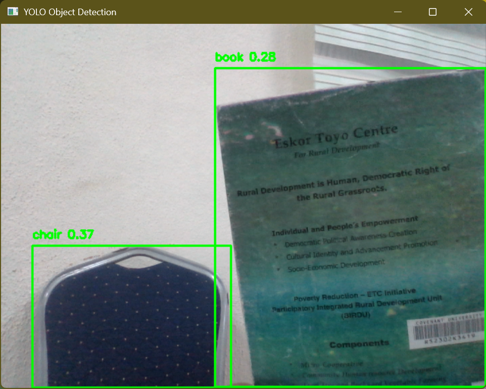

# 🎯 AI Object Detection System

A real-time object detection system built using YOLOv8 and OpenCV. This project uses a webcam to detect and label objects with bounding boxes and confidence scores.

##  Features
- Real-time object detection using webcam
- Bounding boxes with labels and confidence scores
- Fast and efficient YOLOv8 model
- Clean and simple implementation

##  How It Works
- Uses a pre-trained YOLOv8 model for object detection
- Captures video frames using OpenCV
- Detects objects in each frame
- Draws bounding boxes and labels on detected objects

##  Tech Stack
- Python
- OpenCV
- Ultralytics YOLOv8

## 📸 Preview


##  How to Run

```bash
pip install -r requirements.txt
python object_detection.py
